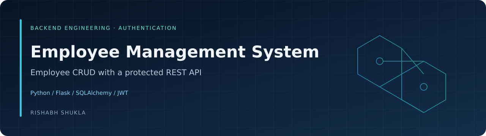

<p align="center">
  
</p>

<p align="center">
  <a href="https://my-portfolio-website-topaz-beta.vercel.app/"><strong>Portfolio & demo access</strong></a>
  &nbsp; · &nbsp;
  <a href="https://github.com/rs6739171-hash"><strong>More projects by Rishabh</strong></a>
</p>

---

# Employee Management System with JWT Authentication

A simple college mini project / 15-day internship project using Python, Flask, SQLAlchemy and JWT authentication.

## Features

- Admin login
- JWT authentication with 1-hour expiry
- Add employee
- View employees
- Search employee
- Edit employee
- Delete employee
- Protected REST API
- SQLite for local development
- PostgreSQL for deployment

## Project Structure

```text
Employee_Management_System_JWT/
├── app.py
├── run.py
├── config.py
├── extensions.py
├── models.py
├── auth_routes.py
├── employee_routes.py
├── requirements.txt
├── database_schema.sql
├── render.yaml
├── templates/
│   ├── base.html
│   ├── login.html
│   ├── index.html
│   ├── add_employee.html
│   └── edit_employee.html
└── static/
    └── style.css
```

## Local Run

```bash
python -m venv venv
venv\Scripts\activate
pip install -r requirements.txt
python run.py
```

Open: `http://127.0.0.1:5000/login`

Local default credentials:

- Username: `admin`
- Password: `Admin@123`

For deployment, admin credentials and secret keys are provided through environment variables.

## JWT

The access token expires after exactly one hour:

```python
JWT_ACCESS_TOKEN_EXPIRES = timedelta(hours=1)
```

API login:

```http
POST /api/login
```

Example JSON:

```json
{
  "username": "admin",
  "password": "your-password"
}
```

Use the returned token as:

```text
Authorization: Bearer YOUR_TOKEN
```

Protected API endpoints:

- `GET /api/employees`
- `GET /api/employees/<id>`
- `POST /api/employees`
- `PUT /api/employees/<id>`
- `DELETE /api/employees/<id>`

## Architecture

```text
Browser / Postman
      |
      v
JWT Authentication
      |
      v
Flask Application
      |
      v
SQLAlchemy ORM
      |
      v
SQLite (local) / PostgreSQL (deployment)
```
